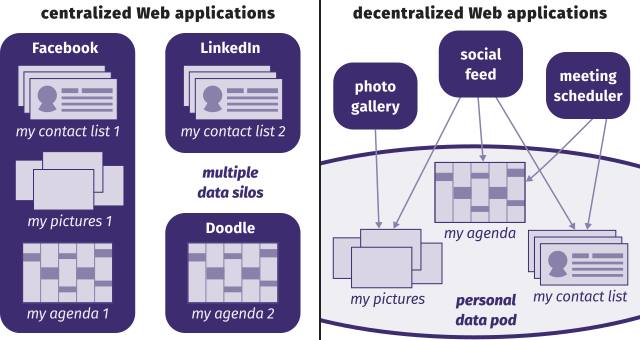
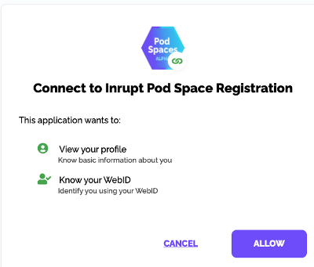
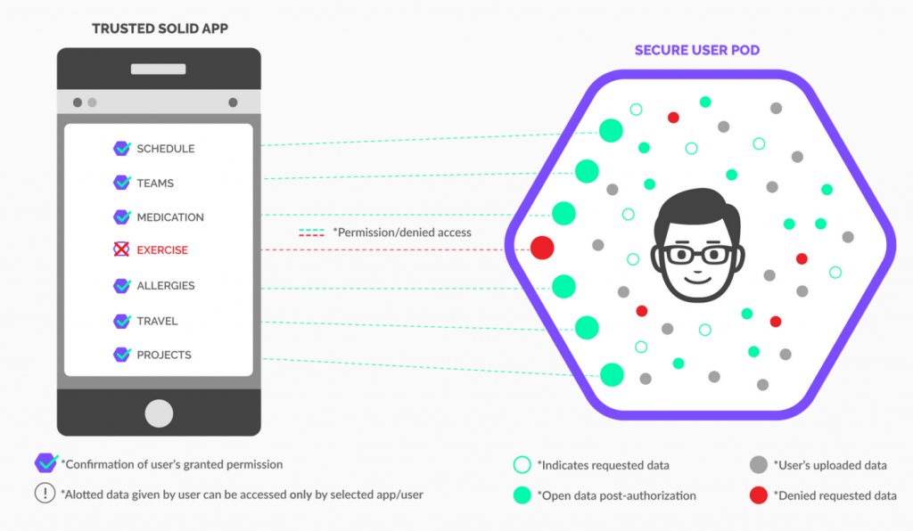
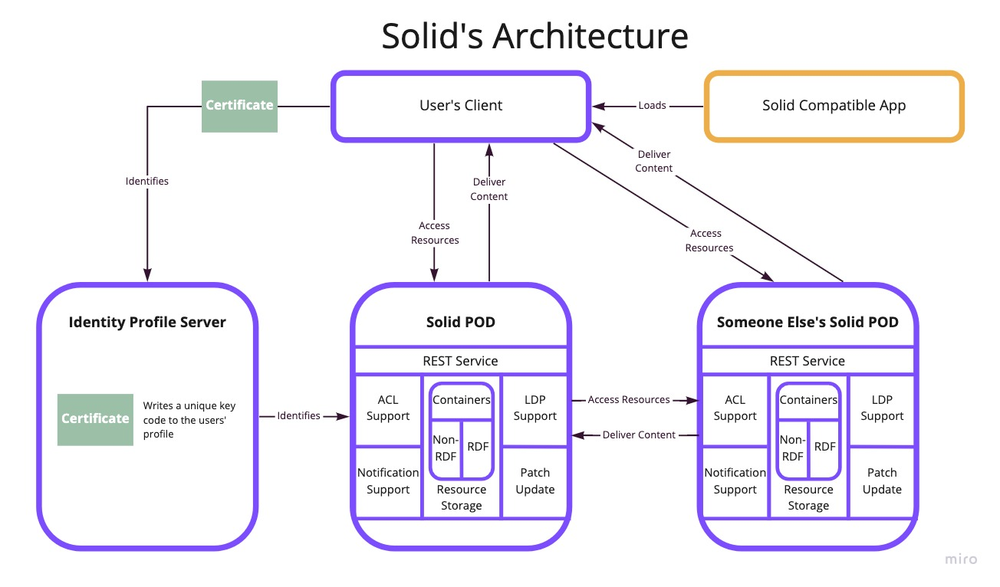

---
authors:
- Greg Kontos
tags:
- Verified Credentials
- Personal Data Stores
- Solid
- Decentralized Internet
- Distributed Internet
title: "Beginning Decentralized Identity Applications with Solid"
date: 2021-09-13T13:59:40-04:00
---

## Summary 

This post is a follow up from ["Distributed Personal Data Stores and Verified Credentials: Potential Opportunities in Finance"](decentralized-data-storage-finance.md) in which we looked at the potential opportunities for distributed data storage and verified credentials in the finance industry.  In this post we look at the technical feasibility and production readiness of the current ecosystem for distributed data storage using the Solid Project.  In order to do that we will look at getting started with implementing an application that uses decentralized identity and data storage.  We will look at using the Solid Project for our application.

# Beginning Decentralized Identity Applications with Solid

## What is the Solid Project?

[Solid is a specification](https://solidproject.org/) that  
>  lets people store their data securely in decentralized data stores called Pods. Pods are like secure personal web servers for your data.
> 
> Any kind of information can be stored in a Solid Pod.
> 
> You control access to the data in your Pod. You decide what data to share and with whom (be it individuals, organizations, and/or applications). Furthermore, you can revoke access at any time.
> 
> To store and access data in your Pod, applications use standard, open, and interoperable data formats and protocols.

This specification allows for transparency in how a user's data is used and permits a 'decentralized' architecture for web applications.  A pod can store any kind of data.  That data can be accessed by any authorized user or application using an [agreed upon and common vocabulary](https://solidproject.org/developers/vocabularies/well-known).  These functionalities allow applications to use data stored across distributed servers. 
|  |
|:--:|
| *Decentralized applications using Solid Pods as datastores* |


## How Does it Work?
When a user loads an application in their browser, the browser requests permission from a user's pod to use specific resources within that person's pod. 
|  |
|:--:|
| *Authorization request from Inrupt's pod browser application* |

Once the application has been authorized to read and/or write data within the pod, the application will read the data and perform whatever tasks are necessary.  Authorization is setup such that the application can access only selected resources from the user's storage pod.  

In practice this means that a user can choose to partially share information with an application.  For instance, if someone wants to use a health and wellness application, they may choose to share information on their medications and allergies but not their exercise habits.
|  |
|:--:|
| *Partial authorization of data sharing* |

## But really, how does it work? 

Solid authentication is built on OpenID connect using what is called "[Solid OpenID Connect specification](https://solidproject.org/TR/protocol#authentication)".  This uses a mechanism called Demonstration of Proof of Possession, or 'DPoP'.  
> "DPoP auth flow differs from Spring’s default OAuth2 flow in two ways: the initial token request contains more information than the usual token request; and, each request made by the app needs to create and sign a JWT that will accompany the request in addition to the access token."  [source: blog discussion of springboot Solid OIDC implementation](https://voidstarzero.ca/post/653158759952269312/dpop-with-spring-boot-and-spring-security) 

Authorization uses a system called 'Web Access Control'.  
> "Web Access Control (WAC) is a decentralized cross-domain access control system providing a way for Linked Data systems to set authorization conditions on HTTP resources using the Access Control List (ACL) model." [source: Solidproject.org](https://solidproject.org/TR/protocol#bib-solid-oidc)

For an application to read data from a user's pod, the user must first authenticate with their OpenID provider.  This provider may or may not be the same as the Pod provider.  The OpenID provider is specifically "An OAuth 2.0 authorization server implementing OpenID Connect".  Authenticating with the OpenID provider will provide a DPoP token.  

This DPoP token is then used to make an authorization request to the Pod provider.  If the user has granted access to the resource then the Pod provider will return the requested resource in the response.  

Individual [resources (aka pieces of data) in the Solid Specification are identified using 'vocabularies' ( aka ontologies )](https://solidproject.org/developers/vocabularies) which are written using RDF (Resource Description Framework) turtle syntax.  This creates a unique URL for each piece of information within a users Pod to which ACL's can be associated.  For a more thorough explanation of the work flow check out [this primer](https://solid.github.io/solid-oidc/primer/).

|  |
|:--:|
| *Pod and Authentication architecture* |


## Example 

Let's take Solid for a quick spin and see what it's like.  The Solid Project has a [helpful tutorial to get us started](https://solidproject.org/developers/tutorials/first-app).  This project sets us a basic webpage that will ask for authorization to a user's profile in their pod, write some data, and read that data back.  It's simple JavaScript and html, but it uses NPM to pull in some client libraries to handle the authorization and some tasks with Pod data.  [Inrupt also has a React SDK](https://github.com/inrupt/solid-ui-react) which is probably where you want to start if you're building out an actual POC.

The first thing to do is to setup a Pod account.  I used the [one available from Inrupt](https://signup.pod.inrupt.com/), which at the time of the writing is the only listed as compliant with the specifications.  

The next thing to do is get the sample resources running locally.  If you are using the Inrupt.com pod, the example code needs to be updated such that 
>  const SOLID_IDENTITY_PROVIDER = "https://broker.pod.inrupt.com/"; 

This value isn't particularly easy to find, but I found it at [docs.inrupt.com](https://docs.inrupt.com/pod-spaces/)

Before we run the application, let's take a look at how the data we are about to update is structured.  Inrupt offers a 'Pod Browser' application from which you can download any of the data stored in your pod.  Going through pod browser we can find the 'card' resource under the 'profile' container.

The 'card' currently contains 
```
<https://pod.inrupt.com/<yourprofilename>/profile/card>
        rdf:type           ldp:RDFSource ;
        rdf:type           foaf:PersonalProfileDocument ;
        foaf:primaryTopic  <https://pod.inrupt.com/<yourprofilename>/profile/card#me> ;
        foaf:maker         <https://pod.inrupt.com/<yourprofilename>/profile/card#me> .

<https://pod.inrupt.com/<yourprofilename>/profile/card#me>
        <http://www.w3.org/ns/solid/terms#privateTypeIndex>  <https://pod.inrupt.com/<yourprofilename>/settings/privateTypeIndex.ttl> ;
        rdf:type   foaf:Person ;
        ldp:inbox  <https://pod.inrupt.com/<yourprofilename>/inbox/> ;
        <http://www.w3.org/ns/solid/terms#oidcIssuer>  <https://broker.pod.inrupt.com/> ;
        foaf:name  "<yourprofilename>" ;
        <http://www.w3.org/ns/solid/terms#publicTypeIndex>  <https://pod.inrupt.com/<yourprofilename>/settings/publicTypeIndex.ttl> ;
        <http://www.w3.org/ns/solid/terms#account>  <https://pod.inrupt.com/<yourprofilename>/> ;
        <http://www.w3.org/ns/pim/space#storage>  <https://pod.inrupt.com/<yourprofilename>/> ;
        rdf:type   <http://schema.org/Person> ;
        <http://www.w3.org/ns/pim/space#preferencesFile>  <https://pod.inrupt.com/<yourprofilename>/settings/prefs.ttl> .

<https://pod.inrupt.com/<yourprofilename>/profile/card>
        rdf:type  ldp:RDFSource .
```

Now we run the application according to the tutorial instructions.  You will be prompted to authenticate with your OpenId provider.  You will then be prompted to allow the application access to your pod.  After running the sample application the card contains:
```
<https://pod.inrupt.com/<yourprofilename>/profile/card>
        foaf:maker         <https://pod.inrupt.com/<yourprofilename>/profile/card#me> ;
        foaf:primaryTopic  <https://pod.inrupt.com/<yourprofilename>/profile/card#me> ;
        rdf:type           foaf:PersonalProfileDocument .

<https://pod.inrupt.com/<yourprofilename>/profile/card#me>
        <http://www.w3.org/ns/solid/terms#privateTypeIndex>  <https://pod.inrupt.com/<yourprofilename>/settings/privateTypeIndex.ttl> ;
        rdf:type   foaf:Person ;
        ldp:inbox  <https://pod.inrupt.com/<yourprofilename>/inbox/> ;
        <http://www.w3.org/ns/solid/terms#oidcIssuer>  <https://broker.pod.inrupt.com/> ;
        foaf:name  "<yourprofilename>" ;
        <http://www.w3.org/ns/solid/terms#publicTypeIndex>  <https://pod.inrupt.com/<yourprofilename>/settings/publicTypeIndex.ttl> ;
        <http://www.w3.org/ns/solid/terms#account>  <https://pod.inrupt.com/<yourprofilename>/> ;
        <http://www.w3.org/ns/pim/space#storage>  <https://pod.inrupt.com/<yourprofilename>/> ;
        rdf:type   <http://schema.org/Person> ;
        vcard:fn   "REAL NAME" ;
        <http://www.w3.org/ns/pim/space#preferencesFile>  <https://pod.inrupt.com/<yourprofilename>/settings/prefs.ttl> .

<https://pod.inrupt.com/<yourprofilename>/profile/card>
        rdf:type  ldp:RDFSource .
```

The line
> vcard:fn   "REAL NAME" ;

was added to the profile.

## Conclusion

The demo application for Solid was very easy to setup and does a good job of showing the basic functionality of a Solid Application.  And with the existence of a React component it should be relatively straight forward to bring Solid into a modern web application.  One thing that was noted in the setup is that very few of the resources are production ready.  The Inrupt Pod storage itself is marked as being for Beta usage due to outstanding security concerns.  While the specifications for Verified Credentials have been agreed upon, the specifications around the Solid Project are currently unsettled.  Solid at the moment looks like the most complete and open method of building applications around Verified Credentials, but until the solution is more technically complete implementations will continue to address more fringe use cases. 

## Resources

### General Information 
* [Georgetown Technical Analysis](http://solid.georgetown.domains/technical-component/)
* [privacy-formula.com](https://privacy-formula.com/reader/tim-berners-lee-unveils-next-step-for-solid-a-decentralized-web-platform-with-privacy-built-in-as-standard/)
* [Presentation on Solid](https://rubenverborgh.github.io/Solid-DeSemWeb-2018/)
* [Security Description](https://voidstarzero.ca/post/653158759952269312/dpop-with-spring-boot-and-spring-security)

### Getting Started 
* [Solid Project Getting Started Guide](https://solidproject.org/developers/tutorials/getting-started)
* [Introductory Resource](https://github.com/solid/solid-tutorial-intro)

### Technical Resources 
* [Inrupt Docs](https://docs.inrupt.com/pod-spaces/)
* [Solid React SDK](https://github.com/inrupt/solid-ui-react)
* [More on Access Policies](https://docs.inrupt.com/ess/latest/security/authorization/#example-access-policies)
